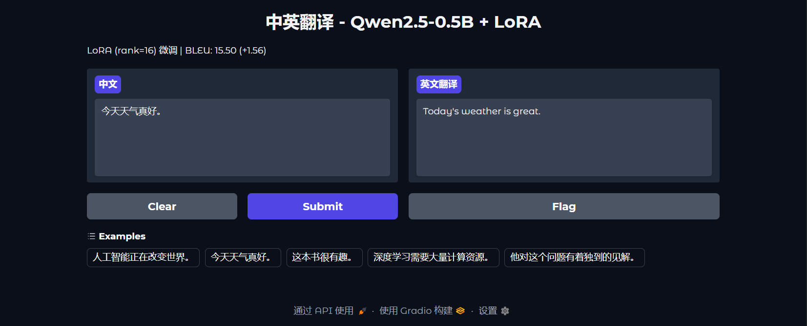

# LoRA Fine-tuned Qwen2.5 for Chinese-English Translation

LoRA (rank=16) fine-tuned [Qwen2.5-0.5B-Instruct](https://huggingface.co/Qwen/Qwen2.5-0.5B-Instruct) on OPUS-100 en-zh for Chinese-to-English translation.

**Live Demo**: [Gradio Demo](https://85d247cb656429fe8e.gradio.live) | Or run `python app.py` locally (GPU required).



**Model**: Qwen2.5-0.5B-Instruct + LoRA (local weights)

## Results

| Model | BLEU |
|---|---|
| Qwen2.5-0.5B (zero-shot) | 13.95 |
| Qwen2.5-0.5B + LoRA (ours) | **15.50** (+1.55) |

BLEU evaluated on 200 test samples from OPUS-100 en-zh using SACREBLEU.

## Training Details

- **Dataset**: [Helsinki-NLP/opus-100](https://huggingface.co/datasets/Helsinki-NLP/opus-100) en-zh, 20K filtered training pairs
- **Method**: LoRA (rank=16, alpha=32, dropout=0.05) on all attention + FFN linear layers
- **Base Model**: Qwen2.5-0.5B-Instruct (float16)
- **Training**: 1 epoch, lr=2e-4, cosine schedule, warmup=3%, effective batch size=32
- **GPU**: NVIDIA T4 (16GB), ~10 minutes
- **Trainable params**: 8,798,208 / 323,917,696 (2.72%)

## Data Filtering

OPUS-100 contains noisy subtitle data. Applied filters:
- Sentence length: zh < 80 chars, en < 120 chars
- Removed dialogue markers (`--`, `...`)
- Kept only single-sentence samples (one period-ending sentence)

Without filtering, the fine-tuned model generated multi-sentence continuations.

## Key Findings

- LoRA fine-tuning improved BLEU by **+1.55** over the zero-shot baseline
- Data quality matters more than training epochs — 3 epochs caused overfitting (BLEU dropped)
- First-sentence truncation post-processing was sufficient for the OpenSubtitles noise

## Usage

```bash
# Run Gradio demo locally (GPU required)
python app.py
```

## Files

- `train_clean.py` — Clean 10-cell Kaggle notebook
- `train.ipynb` — Kaggle training notebook
- `requirements.txt` — Python dependencies
- `app.py` — Local Gradio demo
